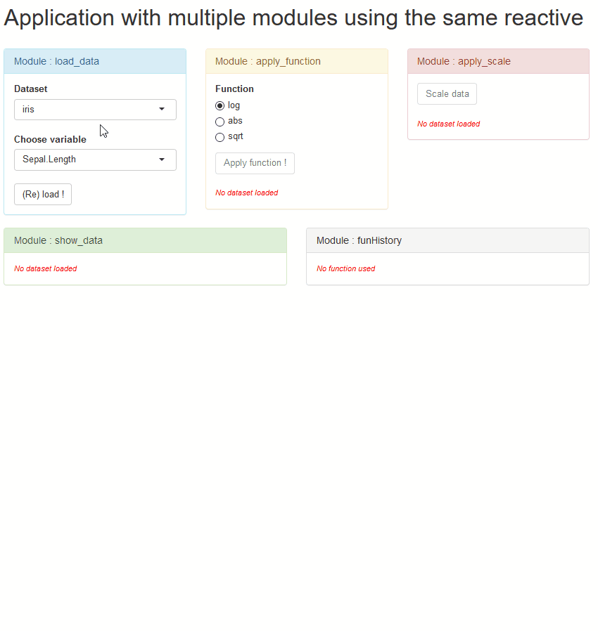

<!-- README.md is generated from README.Rmd. Please edit that file -->
Install the package
-------------------

``` r
# install.packages("remotes")
remotes::install_github("ardata-fr/Shiny-Modules-Tutorials")
```

List & run Shiny applications examples
--------------------------------------

``` r
library(shinyModulesTuto)
listEx()
runEx(listEx()[1])
```

List of examples applications :
-------------------------------

-   Data from Application to Module, [Online app](https://qfazille.shinyapps.io/app-vs-module/)

``` r
runEx("app-vs-module")
```

-   Data from Module to Application, [Online app](https://qfazille.shinyapps.io/module-vs-app/)

``` r
runEx("module-vs-app")
```

-   Data from Application updated in Module, [Online app](https://qfazille.shinyapps.io/app-pong-module/)

``` r
runEx("app-pong-module")
```

-   Application with all examples, [Online app](https://qfazille.shinyapps.io/whole-app/)

``` r
runEx("whole-app")
```


